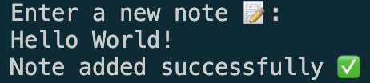

# NotesTool

**NotesTool** is a simple command-line tool written in Go that allows users to manage single-line notes within different collections. Each collection is stored as a separate text file, making it easy to organize, view, add, and remove notes.

## Features

- Create collections of notes, each stored as a text file
- Add new single-line notes to a collection
- View all notes in a specific collection
- Remove existing notes from a collection

## Usage

1. **Create a New Collection**: Start a collection by running `./notestool [COLLECTION_NAME]` in the command line. All notes for this collection will be stored in a corresponding file.
2. **Choose an Option**:
   - **Show Notes**: Display all notes in the collection.
   - **Add a Note**: Create a new note to add to the collection.
   - **Delete a Note**: Remove a specific note from the collection.
3. **Exit the Program**: Type "4" to exit the tool.

## Example

### Creating a New Collection

To create a new collection named "Example":

 

### Welcome Page

After creating a collection, you’ll see the welcome page:

 

### Adding a New Note

To add a new note, select "2":

 

Now, enter a new note, for example, "Hello World!":

 

### Viewing Notes

To view your notes in the "Example" collection, press "1":

 

### Deleting a Note

To delete a note, type "3" and specify the note number you want to delete. If you decide not to delete anything, type "0" to return to the main menu:

 

### Exiting NotesTool

To exit NotesTool, type "4" in the main menu:

 
